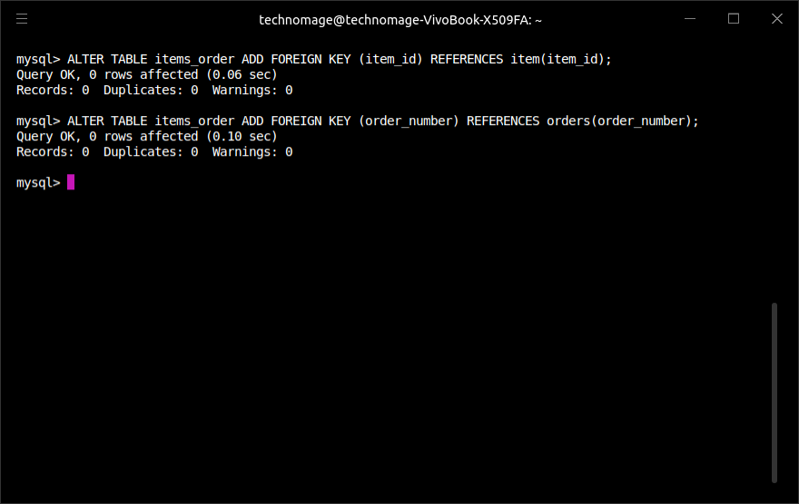

# The Quick Food Management System (QuickFoodMS)

## Index

1. Introduction
2. Installation
3. Usage
4. Maintenance and Help
5. Credits

### 1. Introduction

Quick Food is a fictional food delivery company that has a fleet of drivers that transport meals from local restaurants to customers. They required a Java program that will create and keep track of all orders until the order is finalised and an invoice is genereated by the program.  

Using this application Quick Foods can capture and access their orders and obtain information about orders at any time. They can for instance determine which orders are allocated to a driver at any given time using the program. Many other functionalities are included as will be seen by looking at the main menu.  

It was obvious that a database will be needed to store the information of the various orders in a meaningful way. The decision was to use MySQL for this purpose, together with Java's Java Database Connectivity(JDBC) API to interact with the database.

### 2. Installation

This application currently only runs within an IDE. [Eclipse](https://www.eclipse.org/) or [IntelliJ IDEA](https://www.jetbrains.com/idea/) is recommended.

This application needs a locally set up database to work, so the setup of the MySQL database, QuickFoodMS_db, will be outlined below.

A workable knowledge of MySQL is assumed.

It is also assumed that MySQL is installed on the system that will host the application. If not, refer to [MySQL installation](https://dev.mysql.com/downloads/mysql/).

The database was set up with the name **QuickFoodMS_db** with the following tables:

- orders
- customer
- driver
- restaurant
- items_order
- item

#### 2.1 Table Specification

The tables were set up as per the specifications of the command line screenshots below:  

##### 2.1.1 The orders table

##### 2.1.2 The customer table

##### 2.1.3 The driver table

##### 2.1.4 The restaurant table

##### 2.1.5 The items_order table

##### 2.1.6 The item table

#### 2.2 MySQL user data

The MySQL username and password that was used for the creation of the database must be substituted in the main method of the `QuickFoodMS.java` file. The below screenshot gives an indication of where this must take place.  

Also make sure that the database URL (dbURL) is applicable to the system that will run the application.

#### 2.3 Conclusion

This concludes the installation discussion. If you have any further questions please contact me via [email](mailto:vanvuurenjohann124@gmail.com).

### 3. Usage

The application at this stage is run in an IDE as mentioned earlier. To do so either import the project into Eclipse or IntelliJ IDEA or create a new project called "QuickFoodMS" and add the `QuickFoodMS.java` file to the project as a source (src) file. Once this has been completed simply click on `run` in the IDE.

The application is very easy to use and navigate, due to a simple menu structure where a number is selected and the user is then prompted to enter the information required by the application to perform the requested operation.

All menus and information prompts work on the same principle, so only one exampe will be used to show how the program works.

The following screenshot shows how a user of QuickFoodMS would go about finding out which orders are pending.

A main menu is presented:  

In this scenario option 5 (List Pending Orders) will be selected, upon which the user will be presented with the list of pending orders:  

All functionalities of the application follows this workflow / controls and will therefore not be discussed individually for the sake of brevity and not repeating already stated information.

### 4. Maintenance and Help

The application is currently maintained by Johann Jansen van Vuuren and there are currently no contributors.  

Should you require any help with any aspect of this application, please feel free to contact me via [email](mailto:vanvuurenjohann124@gmail.com).

### Credits

This application was developed by Johann Jansen van Vuuren under the guidance of HyperionDev&copy;  
